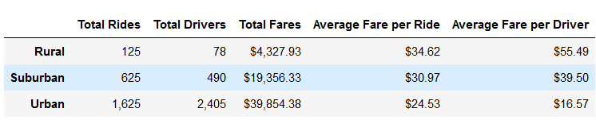
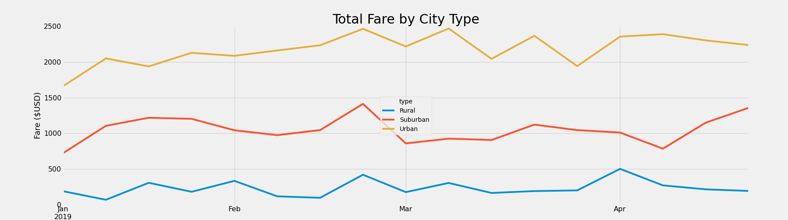

# Pyber_Analysis
## Overview of the Analysis
The purpose of this analysis is to create a multiple line graph that shows the total weekly fares for each city type. The three city types that are analyzed are rural, urban and suburban. By putting this together, the decision-makers at PyBer could see if any changes should be made.
## Results
From the summary data frame a number of things could be seen. Urban cities have more rides and more drivers. While rural cities have way less drivers, as well as rides. The average fare per ride and driver is also much higher in the rural cities than in urban and suburban cities. As you could see in the chart, there's a trend that shows the average fare per ride and driver seems to increase the further you are from an urban area. Another trend that is seen is the more populated an area is, the more rides there are which leads to having more drivers and higher fares. 

  

The multiple line chart shows the total fare by city type from January to April. You could also see in this chart how the Urban cities fares are much higher than the other two area types. For all city types, there is a peak of rides at the end of February which correlates with higher fares. 

  

## Summary
From the multiple line chart it is seen that suburban areas there is an increase in rides in April which is different than in the other city types. Perhaps this is something to look into in order to see what causes that peak and how the other city types could also have an increase.

From this analysis we are able to see how the average fare per ride and driver have a significant increase in less populated cities. This is due to most likely having less drivers available. In order to increase the total fares maybe more drivers could be added which will lead to lower fare per ride and more people taking rides. 

